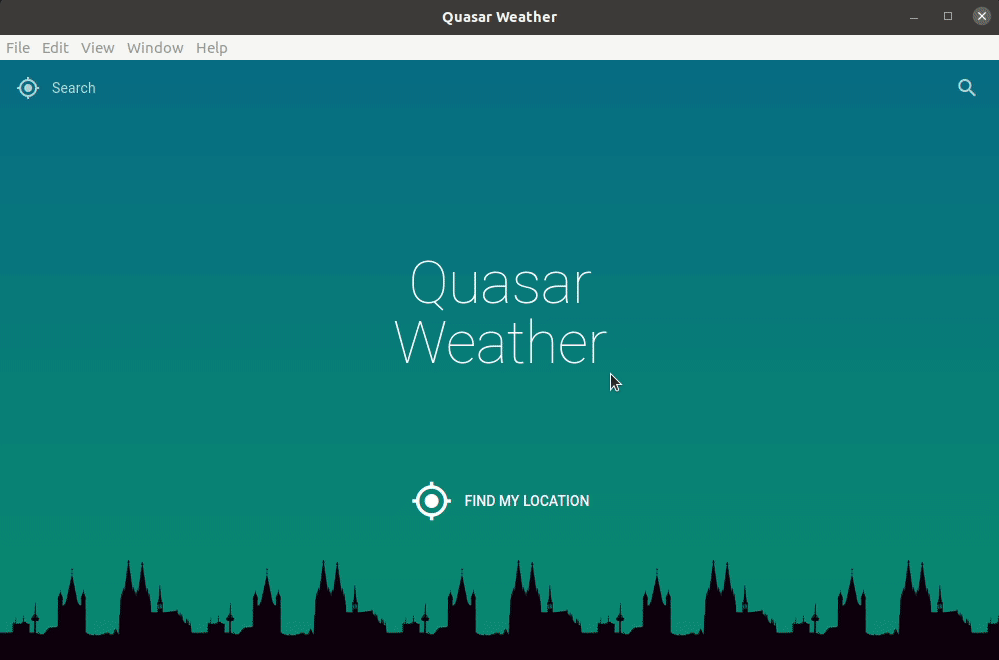

# Projects
## Quasar Weather
### for Desktop (Linux - MacOs - Windows)


### for Mobile (IOS - Android)


## Projects setup
### for Quasar Weather
```
- npm install
- npm install -g @vue/cli
- npm install -g @quasar/cli
```

### Compiles and hot-reloads for development
```
quasar dev
```

### Compiles and minifies for production
```
quasar build
```

### Customize the configuration
See [Configuration quasar.conf.js.](https://quasar.dev/quasar-cli/quasar-conf-js).
